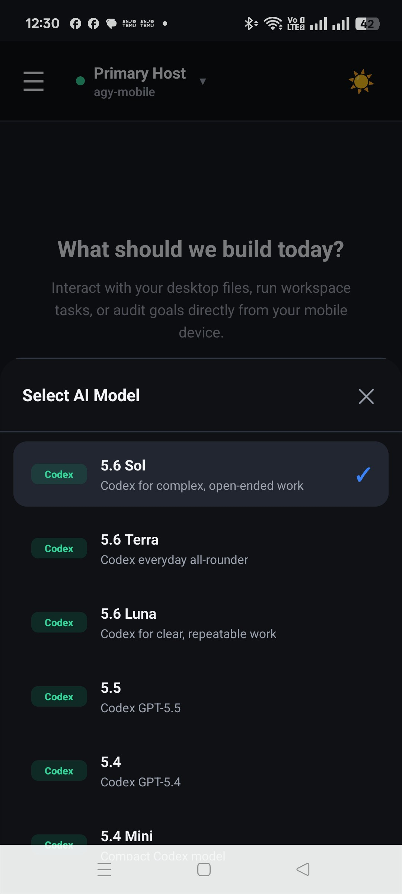

# KookAI AI Agent (Web & Mobile Companion)

**KookAI** is an AI Agent system that bridges your desktop workspace with a mobile application and Web Console. It enables you to execute tasks, analyze code, transcribe audio, and process video content seamlessly across multiple LLM providers.

<p align="center">
  
</p>

---

## ✨ Key Features

- 🤖 **Multi-Provider AI CLI:** Integrated support for leading AI models and CLIs:
  - **Antigravity (`agy`):** Gemini 3.8 Flash, Gemini 3.7 Flash/Pro, Gemini 3.6 Flash, Claude, GPT-OSS, DeepSeek Pro 0813
  - **Codex (`codex`):** OpenAI 6 Astra / 5.6 Sol / Terra / Luna
  - **Claude Code (`claude`):** Anthropic Claude 3.7 / 3.5
  - **Kimi Code (`kimi`):** Moonshot Kimi K3
  - **xAI Grok (`grok`):** Grok 4.6 / 4.5 / 4.20 / Grok Build
  - **Meta Muse (`muse`):** Muse Spark 1.2
  - **Z.ai GLM (`opencode`):** GLM 5.2, GLM 5 Turbo, GLM 4.7, GLM 4.5 Air
- 🎥 **Universal Video Analysis & `/watch` Command:**
  - Extracts keyframes and audio tracks from YouTube, TikTok, Vimeo, direct URLs, or local video files (`.mp4`, `.mov`).
  - High-precision Thai/English speech-to-text powered by **Groq / OpenAI Whisper (`whisper-large-v3`)**.
  - ⚡ **Multi-Key Rotation & Failover:** Supports multiple API keys with round-robin load balancing and automatic key rotation upon hitting rate limits.
- 🌐 **Cloudflare Quick Tunnel & Pairing Code:** Secure remote connection setup allowing mobile access from anywhere without port forwarding.
- ⚙️ **Web Dashboard & Settings UI:** Manage server status, check CLI availability, and configure API keys via an intuitive web console at `http://localhost:8080`.
- 🖼️ **Generated Media Rendering:** Markdown image/video links returned by local tools (including AiPassport artifacts) are rendered in the web and mobile clients through the authenticated `/api/media` endpoint; mobile videos play inline with native controls.

---

## 🚀 Quick Start (Server Setup)

### 1. Installation & Start
```bash
# macOS / Linux
./run_server.sh

# Windows
run_server.bat  # (or python main.py)
```
> **Note:** On first launch, the system automatically creates a virtual environment, installs Python dependencies, and downloads any missing CLI executables (`agy`, `claude`, `codex`, `kimi`, `grok`, `muse`, `opencode`).

### 2. Connect Z.ai GLM Coding Plan

KookAI runs GLM through OpenCode, an officially supported Z.ai CLI integration.

```bash
npm install -g opencode-ai
opencode auth login
```

Choose **Z.AI Coding Plan** and enter the API key from the Z.ai console. You can
also use **Settings → Connections → Z.ai GLM via OpenCode → Connect**. To verify
the exact model IDs available to your account, run:

```bash
opencode models zai-coding-plan --refresh
opencode run --format json --model zai-coding-plan/glm-5.2 "Explain this repository"
```

For a regular pay-as-you-go Z.ai API account, choose **Z.AI** during login and
set `ZAI_OPENCODE_PROVIDER=zai` in `.env`.

### 3. Meta Muse Spark Setup (`muse login`)
- **Automatic Installation:** The server checks for and installs the `muse` CLI automatically if missing.
- **Authentication:**
  - **Option 1 (via Web Dashboard):** Open `http://localhost:8080` -> **Settings → CLI Status** and click **Connect** next to **Meta Muse Code**.
  - **Option 2 (via Terminal):** Run the login command directly:
    ```bash
    muse login
    ```

### 4. Configure Whisper API Key (for Video Transcription)
Sign up for free API keys at the [Groq Console](https://console.groq.com/keys) and configure using either method:
- **Option 1 (via `.env` file):**
  ```env
  GROQ_API_KEY=gsk_key1, gsk_key2, gsk_key3
  ```
- **Option 2 (via Web UI):** Open `http://localhost:8080` -> **Settings → General** -> enter keys in **Whisper API Keys** and click **Save Changes**.

### 5. Pair Mobile Application
1. Open `http://localhost:8080` on your computer.
2. Click **Generate PIN**.
3. Open the KookAI app on your mobile device and enter the 6-digit PIN or scan the QR Code to connect.

---

## 🎥 Video Transcription & Analysis Examples (`/watch`)

| Command / Usage | Description |
| :--- | :--- |
| `/watch https://youtu.be/XXXXXX Summarize this video` | Extract keyframes + audio, transcribe speech, and summarize main insights. |
| `/watch https://youtu.be/XXXXXX Generate timeline` | Transcribe speech with timestamps for key moments. |
| `/watch https://youtu.be/XXXXXX Extract code` | Extract code snippets and step-by-step tutorial instructions. |
| `[Attach .mp4 file] Summarize content` | Analyze and transcribe a local video file uploaded directly. |

*(For more prompt examples, refer to [`video_analysis_prompts.txt`](video_analysis_prompts.txt))*

---

## 🛠️ CLI & Model Providers Matrix

| Provider | CLI Command | Supported Core Models | Special Controls |
| :--- | :--- | :--- | :--- |
| **Antigravity** | `agy` | Gemini 3.8/3.7 Flash/Pro, Claude | Sandbox / Real |
| **Codex** | `codex` | 6 Astra, 5.6 Sol, 5.6 Terra, 5.4 Mini | Effort (Low-Ultra), Speed (Fast/Std) |
| **Claude Code** | `claude` | Claude 3.7 Sonnet, Opus | Effort (Low-Max), Extended Thinking |
| **Kimi Code** | `kimi` | Kimi K3 | Stream-JSON, Resumable Session |
| **xAI Grok** | `grok` | Grok 4.6, Grok 4.5, Grok Build 0.1 | Reasoning Effort (Low-High) |
| **Meta Muse** | `muse` | Muse Spark 1.2 | Effort (Low-High), Stream-JSON |
| **Z.ai GLM** | `opencode` | GLM 5.2, GLM 5 Turbo, GLM 4.7, GLM 4.5 Air | JSON events, Resumable Session |

---

## 📱 Mobile Application Setup

The mobile app is built with **React Native / Expo**:

```bash
cd mobile
npm install
npx expo start
```

### Android Release Build:
```powershell
cd mobile\android
.\gradlew.bat assembleRelease
adb install -r .\app\build\outputs\apk\release\app-release.apk
```

After changing the mobile renderer (for example, generated AiPASS media
links), reload the Expo development client or rebuild/reinstall the Android
APK so the updated JavaScript bundle is installed on the phone.

---

## 📄 Support & License

- **License:** MIT License
- **Developer Contact:** rangsarn@gmail.com
- **Donations:** `0xcCAe4BDA3F9A92dd14D4193680535128f7DEE842` (EVM Address)
